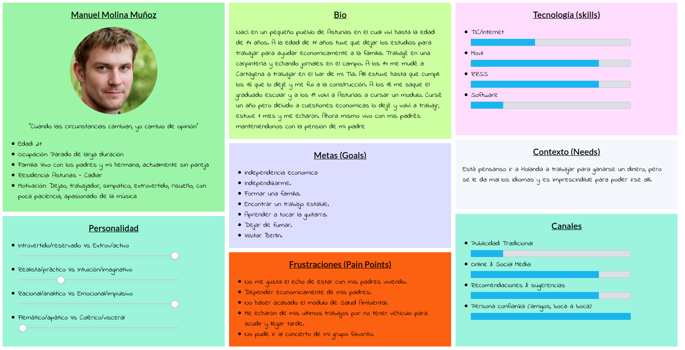
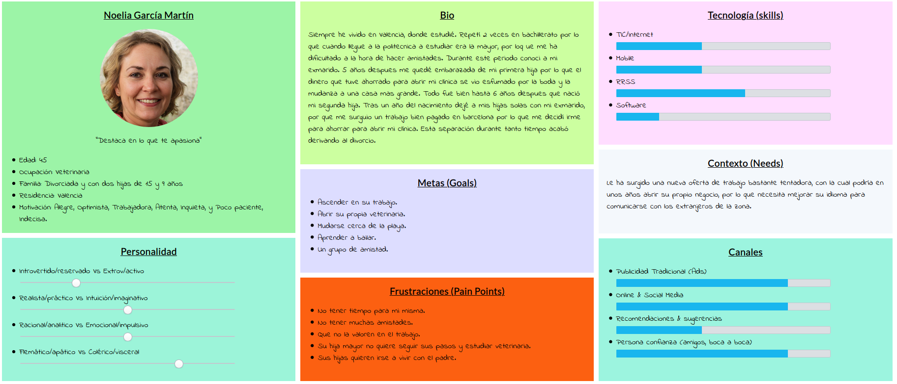
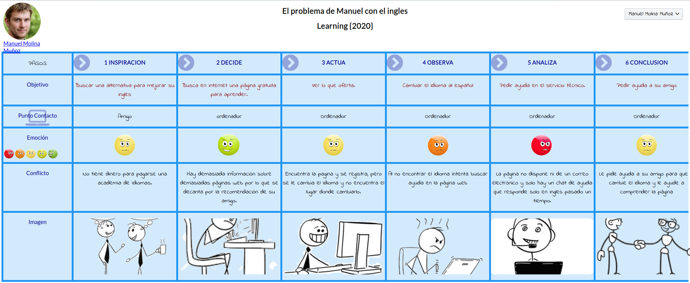
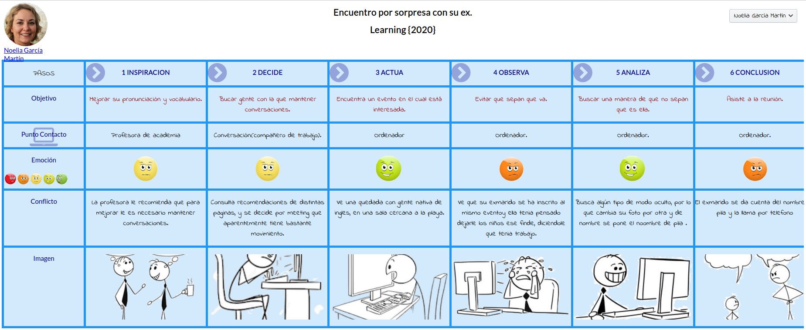

## DIU - Practica1, entregables

- Desk research: Análisis Competencia.

He encontrado una serie de plataformas que se ajustan a lo que se está buscando.

[Meetup-Language](https://www.meetup.com/es-ES/find/language/).Plataforma que también se le ha dado el uso para el aprendizaje de idiomas en grupos donde tu mismo puedes crearlos además compartir experiencias y el idioma.

[Verbling](https://es.verbling.com/).A través de esta plataforma puedes realizar intercambios de idiomas con personas de diferentes países.La plataforma te conecta con profesores nativos de estas lenguas con los que podrás llevar a cabo conversaciones y mejorar tu nivel de idiomas hasta hablar como un verdadero nativo.

[Busuu](https://www.busuu.com/es).Se trata de la mayor red social para el aprendizaje de idiomas. Puedes contactar con hablantes nativos en todo el mundo desde tu ordenador, tableta o móvil.Además puedes enviar ejercicios escritos para que te los corrijan y también puedes corregir a otros estudiantes de busuu en tu lengua materna.

[Tandem](https://www.tandem.net/es).Intercambio de idiomas online. Ofrece la posibilidad de practicar un idioma con hablantes nativos de diferentes lenguas. Practica escuchando, mejora tu pronunciación, y aprende a hablar como un autóctono sin importar donde estés.Esta herramienta también cuenta con una aplicación que puedes descargar y llevarla en tu bolsillo a todas partes.

[Hello Talk](https://www.hellotalk.com/#sp).Las herramientas intuitivas de HelloTalk proporcionan una experiencia que hace nunca antes haya sido tan fácil aprender y practicar un idioma nuevo.

[Lingvu](https://www.facebook.com/lingvu).La peculiaridad de esta herramienta es que apuesta por el intercambio de idiomas cara a cara. Para ello, se basa en la proximidad de los interlocutores.Básicamente,se encuentran por la aplicación y quedan en un lugar cercano para practicar idiomas presencialmente. La app ofrece diferentes opciones para encontrar perfiles que se parezcan al tuyo y poder practicar cómodamente.

[Hi uTandem](https://www.facebook.com/Hiutandemapp/).Es otra aplicación para intercambio de idiomas basada en la proximidad de los interlocutores. Esta disponible para iOS y Android y con ella podrás conocer y aprender idiomas con personas que viven en tu misma ciudad o en la ciudad. Muy útil si estás viviendo en el extranjero y quieres mejorar tu nivel de idioma.

Tabla de comparativas:

|EMPRESAS                        | Meetup-Language | Verbling | Busuu     | Tandem   | Hello Talk  | Lingvu   | Hi uTandem |
| :------:                       | :------:        | :------: |  :------: | :------: |  :------:   | :------: |  :------:  |
| Gratis                         | SI              |  SI      |     SI    | SI       | SI          | SI       |  SI        |
| Opción de pago                 | SI              |  NO      |     SI    | NO       | NO          | NO       |  NO        |
| Más de un idiomas              | SI              |  SI      |     SI    | SI       | SI          | NO       |  SI        |
| web                            | SI              |  SI      |     SI    | SI       | SI          | NO       |  NO        |
| Android                        | SI              |  NO      |     SI    | SI       | SI          | NO       |  SI        |
| iOS                            | SI              |  NO      |     SI    | SI       | NO          | NO       |  SI        |
| Proximidad de interlocutores   | SI              |  NO      |     NO    | NO       | NO          | NO       |  SI        |
| Videoconferencia               | NO              |  SI      |     SI    | SI       | SI          | SI       |  SI        |
| Chat                           | SI              |  SI      |     SI    | SI       | SI          | SI       |  SI        |
| Herramientas lingüísticas      | NO              |  SI      |     SI    | SI       | SI          | NO       |  SI        |

- 2 Personas

En primer lugar hemos creado a Manuel, una persona con amplias capacidades pero con poca iniciativa en el mundo de las redes sociales y en este sentido Manuel se plantea como un colectivo de la plataforma pues uno de sus retos ya sea por trabajo u ocio le hacen usar esta aplicación.

Por último, también hemos creado a Noelia, la cual es una persona bastante tímida, y que además no está iniciada en el mundo de estas nuevas plataformas por lo tanto le es difícil hacer esta tarea además de que sus circunstancias familiares no la da mucho margen de tiempo libre.

- 2 User Journey Map

El problema de Manuel con el ingles.

La primera historia trata sobre nuestro amigo Manuel que para aprender ingles busca en páginas web hasta dar con la acertada(recomendada por un amigo) y como la página se le pone en ingles pide ayuda al servicio técnico que tarda bastante en responder y que al final le pide ayuda a su amigo.

historia de que se tienen que ir a otro lugar y no le dejan acceder aunque haya pagado en otra zona.

Encuentro por sorpresa con su ex.

La segunda historia trata sobre nuestra amiga Noelia que se apunta a una página para aprender idiomas y allí descubre que en el grupo en el que está se encuentra su exmarido y por eso cambia su nombre y su foto pero esta es reconocida por el exmarido porque uso su nombre de pila.

- Revisión de Usabilidad

>>> - Enlace al documento:
      Para ver el PDF [pulse aquí](https://github.com/salva12345678/DIU/blob/master/P1/Usability-review.pdf)

>>> - Valoración final:64
>>> - Comentario sobre la valoración:En general la web cumple con las principales características y metas que se persiguen.La información que se muestra es precisa y no es redundante.Los resultados de las búsquedas son relevante y precisas.El rendimiento de la página es excelente.Existen otros aspectos que no han sido muy gratificantes.Las funciones de volver atrás fallaban y te llevaba a una pantalla en blanco.En la página hay marcadores que están descuadrados.La ubicación actual no está clara .La búsqueda por parámetros múltiples es bastante pobre.No hay búsquedas comunes sino que ya están definidas.Los usuarios no pueden enviar comentario,no hay correo de la empresa y solo hay un chat de ayuda.

| ASPECTOS POSITIVOS                                    | ASPECTOS NEGATIVOS |
| :------:                                              | :------:           |
| Cumple con el objetivo que se persigue                |  Volver atrás te lleva a una página en blanco         |
| La información precisa y no redundante                |  Los marcadores descuadrados             |
| Los resultado de las búsquedas relevantes.            |  Ubicación no clara                |
| Resultados precisos.                                  |  Parámetros múltiples pobre                |
| Buen rendimiento de la página.                        |  No búsquedas comunes                |
|                                                       |  No se pueden enviar comentarios                |
|                                                       |  No hay correo de la empresa                |
