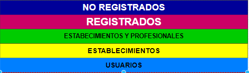
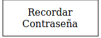

## DIU - Practica 2.

- Feedback Capture Grid: Malla Receptora De Información.

  | Interesante                                                          | Críticas                                          |
  | :------:                       | :------:        |
  | 1.Información precisa y concisa.                                     | 1.Error a la hora de recargar una página anterior.|       
  | 2.Permanencia en grupos en el tiempo.                                | 2.Poca variedad en la asistencia de ayuda.        |      
  | 3.Un buscador por calendario.                                        | 3.Poca coherencia entre secciones.                |
  | 4.La página orienta a los usuarios a que hacer primero.              | 4.Mantener la coherencia del idioma.              |

  | Preguntas                                                            | Nuevas ideas                                      |
  | :------:                                                             | :------:                                          |
  | 1.Se le cambió el idioma tras su registro                            | 1.funcionalidades adaptadas al tipo de usuario.   |
  | 2.Poner claro donde está el servicio técnico.                        | 2.Promociones por bonos o ventajas                |        
  | 3.Chat de ayuda en mi idioma.                                        | 3.Promoción por número de amigos traídos.         |
  | 4.El chat más amplio en cuestión de temas                            | 4.Modo premium.                                   |
  | 5.No hay ninguna guía ni video para principiantes.                   | 5.Penalización y bonificación por la asistencia.  |    
  | 6.Me gustaría un  modo privado.                                      | 6.Un tutorial guiado.                             |
  | 7.Un modo nocturno nocturno.                                         | 7.Un monedero para el saldo.                      |
  | 8.Un modo de realidad virtual  poder quedar con el grupo desde casa. |                                                   |

La aplicación movil a desarollar trata de una plataforma que permite la organización de actividades en grupo que promueven la utilización de lenguas extranejeras. La plataforma pondrá en contacto a las diferentes partes: Usuarios, profesionales y establecimientos, para una mayor facilidad de organización.
Los usuarios tendrán la ventaja de poder realizar estas actividades a costo compartido.
Los profesionales podrán obtener beneficio de impartir un trabajo en estás actividades.
Los establecimientos podrán ofrecer a cambio de unos beneficios, consumo o lo que vea conveniente, sus establecimientos para la realización de la actividad. 

Las ideas vamos a implementar, es que queremos que los grupos prevalezcan en el tiempo ya que queremos crear vinculos entre los integrantes. Un calendario en el que podamos ver de forma mas visual las actividaes inscritos. Implementación de bonos o promociones para los usuarios. Un modopremium que te libre de ciertos pagos y acceso a contenido exclusivo. Un monedero para llevar un control de tus gastos.

- User/task matrix​: Matriz De Tareas y Usuarios.

|GRUPOS DE USUARIOS              | Usuario         | Usuario Premium      | Profesional     | Establecimientos   | Usuarios no registrados  | Ranking  |
| :------:                       | :------:        | :------:             |  :------:       | :------:           |  :------:                | :------: |
| Buscar.                        | Alto            |  Alto                |     Alto        | Alto               | NO                       | 12       |
| Abonar Dinero.                 | Medio           |  Bajo-Medio          |     Alto        | Alto               | NO                       | 10.5     |
| Consultar Correo.              | Medio-Alto      |  Medio-Alto          |     Alto        | Alto               | NO                       | 10       |
| Consultar chat.                | Alto            |  Alto                |     Alto        | Bajo               | NO                       | 10       |
| Consultar Promociones.         | Medio           |  Medio               |     Alto        | Alto               | NO                       | 10       |
| Enviar Correo.                 | Bajo            |  Bajo                |     Alto        | Alto               | NO                       | 8        |
| Consultar Notificaciones.      | Medio           |  Medio               |     Medio       | Medio              | NO                       | 8        |
| Consultar calendario.          | Medio           |  Medio               |     Medio       | Bajo               | NO                       | 7        |
| Asistir actividad.             | Alto            |  Alto                |     NO          | NO                 | NO                       | 6        |
| Alta en grupo.                 | Medio-Alto      |  Medio-Alto          |     NO          | NO                 | NO                       | 5        |
| Crear Actividad.               | Bajo            |  Bajo                |     Medio       | Bajo               | NO                       | 5        |
| Crear Grupo.                   | Bajo            |  Bajo                |     Medio       | Bajo               | NO                       | 5        |
| Consultar establecimiento.     | Bajo            |  Bajo                |     Medio       | Bajo               | NO                       | 5        |
| Borrar actividad.              | Bajo            |  Bajo                |     Bajo        | Bajo               | NO                       | 4        |
| Borrar grupo.                  | Bajo            |  Bajo                |     Bajo        | Bajo               | NO                       | 4        |
| Pasar a privado.               | Bajo            |  Bajo                |     Bajo        | Bajo               | NO                       | 4        |
| Cambiar idioma.                | Bajo            |  Bajo                |     Bajo        | Bajo               | NO                       | 4        |
| Poner modo nocturno.           | Bajo            |  Bajo                |     Bajo        | Bajo               | NO                       | 4        |
| Consultar dinero.              | Bajo            |  Bajo                |     Bajo        | Bajo               | NO                       | 4        |
| Poner Promoción.               | NO              |  NO                  |     Medio       | Medio              | NO                       | 4        |
| Consultar ayuda.               | Bajo            |  Bajo                |     Bajo        | Bajo               | NO                       | 4        |
| Baja de grupo.                 | Bajo            |  Bajo                |     NO          | NO                 | NO                       | 2        |
| Dejar de asistir.              | Bajo            |  Bajo                |     NO          | NO                 | NO                       | 2        |
| Quitar Promoción.              | NO              |  NO                  |     Bajo        | Bajo               | NO                       | 2        |   
| Validar establecimiento.       | NO              |  NO                  |     NO          | Bajo               | NO                       | 1        |
| Hacerte Premium.               | Bajo            |  NO                  |     NO          | NO                 | NO                       | 1        |
| Iniciar Sesión.                | Bajo            |  Bajo                |     Bajo        | Bajo               | NO                       | 3        |
| Registrarse.                   | NO              |  NO                  |     NO          | NO                 | Bajo                     | 1        |

- Labelling:Arquitectura De La Información.

La leyenda correspondiente a la jerarquia para diferenciar correctamente a quien corresponde las funcionalidades

Principal

Empezamos por la jerarquía de la extensión de la aplicación.

Seguimos con la jerarquía de la cabecera de la aplicación.

Continuamos con la jerarquía del cuerpo de la aplicación.

Por ultimo,terminamos con la jerarquía del pie de la aplicación.

Término | Icono | Significado
| ------------- | ------- | ------- |
|  Acerca de  |  | Donde hablamos un poco de nuestra trayectoria y situación actual, y futuros proyectos.Quienes somos.|
|  Actividades  |  | Aparecen los eventos a los que has indicado que asistirás para ver las novedades que surjan en este. |
|  Ajustes  |  | Configuraciones del sistema y usuario |
|  Amigos |  | Veremos nuestra lista actual de perfiles de contacto, añadir nuevos perfiles, y borrar aquellos que no queramos conservar. |
|  Anular actividad  |  | Opción disponible si ya no le interesa asistir al evento y no sufrir las penalizaciones. |
|  Asistir actividad  |  | Si el post es de una actividad nueva, puedes inscribirte mientras haya plazas. |
|  Ayuda y soporte  |  | Si tienes algún problemas aquí encontrarás información útil para solucionarlo. |
|  Buscador  |  | Se accede a un apartado de búsqueda por donde se le proporcionará lo solicitado en función de los parámetros seleccionados:Elegir entre si se está buscando: GRUPO o ACTIVIDAD,Periodo de tiempo: Periodo en el que quiere los resultados de la búsqueda,Lugar: seleccionar las distintas ciudades que quieres que le muestre los resultados,Opción para ver los grupos cerrados y premium,Idiomas de interes,nivel de competencia lingüística.|
|  Correo   |  | Se accede al apartado de mensajería donde podremos ver nuestros contactos y mensajes.                                      |
|  Calendario  |  | Se accede a un calendario personal donde veremos nuestros eventos en el calendario. |
|  Cerrar sesión  |  | Cerramos la sesión actual y volvemos a la pantalla de inicio de usuario. |
|  Chat  |  | De grupo y específicos de evento para tener contactos con aquellos integrantes. |
|  Chat de evento |  | Chat temporal y exclusivo por el cual pueden hablar los que están inscritos, para hablar cosas específicas de los asistentes. Tras esta actividad, será eliminado en un periodo de tiempo. |
|  Chat de ayuda  |  | Chat interactivo donde podrás preguntar a un asistente virtual temas que están predefinidos. |
|  Chat general de grupo |  | Chat que solo tiene acceso los integrantes del grupo, para hablar de la realización de nuevas actividades o discusiones. |
|  Crear grupo o actividad  |  | Se accede a los diferentes formularios para la creación del grupo o actividad. |
|  Crear actividad  |  | Se crea la actividad de un grupo donde se dará un pequeña explicación de la competencia linguística,fotos,lugar del establecimiento,fecha y hora y el precio de la asistencia.|
|  Crear grupo  |  | Se crea un grupo donde se describirá de forma breve su propósito,los idiomas que se van a usar ,el nivel linguístico y si está destinado a ser un grupo público o exclusivo. |
|  Establecimientos  |  | Ver los establecimientos registrados en la web y ver su ofertas. |
|  Extensión panel lateral  |  | Se acceden a funcionalidades más específicas, acceso a perfil, ajustes, Promociones, establecimientos, Premium, servicio Premium. |
|  Formulario de sugerencias  |  | Formulario que puede ser rellenado para hacer llegar cualquier posible error en la web a los desarrolladores. |
|  Grupos  |  | En este apartado aparecerán, en función de su última actividad, los distintos grupos a los que perteneces acompañado de su foto de grupo, y la información que quiere hacer llegar los administradores del grupo, además del anuncio de actividades nuevas propuestas.|
|  Hazte premium  |  |  Para los usuaro general, posibilidad de hacer tu perfil premium, para acceder a sus ventajas:plazas específicas para usuarios premium en actividades,grupos y actividades exclusivos,No pagues por asistencia a actividades.|
|  Gratuito  |  | La otra opción es que sea un usuario normal pero dentro de la aplicación puede hacerse premium. |
|  Idioma  |  | Nos da la opción de elegir el idioma que queremos |
|  Iniciar Sesión  |  | Tras meter los datos del nombre de cuenta y contraseña accederá a la aplicación.|
|  Lista mensajes  |  | Acceso a nuestro buzón de entrada y donde redactar nuestros correos.                                                |
|  Mis establecimientos  |  | Acceso solo para los Usuarios del tipo "establecimiento" donde pueden consultar sus establecimientos, su actividad, disponibilidad, rendimientos, y quitar un estalecimientos y solicitudes realizadas por parte de los usuarios y profesionales.|
|  Mis promociones  |  | Acceso solo para los usuarios de tipo "Profesional", en ellos pueden ver sus promociones ofertadas, elminar su promoción y las solicitudes recibidas por el resto de usuarios indiferente de su rol. |
|  Modo nocturno  |  | Para comodidad del usuario se le da opción de usar el modo oscuro. |
|  Monedero  |  | Consulta del dinero disponible. |
|  Notificaciones  |  | Novedades en el sitio, novedades en la aplicación, perfil, aviso de notificaciones personalizadas. |
|  Para premium |  | Novedades para los premium, Actividades exclusivas, novedades. |
|  Perfil   |  | Hace referencia a los datos del usuario:Correo de app,nombre usuario,foto de perfil,ciudad,actividades realizadas,grupos pertenecientes,fotos compartidas,post publicados,nivel de idioma y idiomas. |
|  Privacidad  |  | Numero de teléfono, correo electrónico, cuenta de banco,etc.|
|  Premium  |  | Se da la posibilidad del usuario de convertirse en un usuario premium durante el registro |
|  Promociones  |  | Acceso a las promociones disponibles por los profesionales y establecimientos y eventos que cuentan con ellos. |
|  Recordar contraseña  |  | En caso de no recordar su contraseña podrá recuperarla rellenando un formulario. |
|  Registrarse  |  | En el llevamos a cabo el registro del nuevo usuario cogiendo datos imprescindibles. |
|  Tendencias  |  | La primera vez que accede a la aplicación le aparecerán grupos cercanos a su posición o con mayor popularidad  |

- Wireframes:Bocetos de la interfaz.

#### 1.Inicio sesión.

#### 2.Primera vista del usuario al registrarse.

#### 3.Vista de extensión.

#### 4.buscador.

#### 5.Cronología de actividades inscripto.

#### 6.Cronología de grupos inscripto.

#### 7.Vista de creación del grupo.

#### 8.Vista de creación de la actividad.

#### 9.Configuración.  

#### 10.Vista del post actividad.

#### 11.Vista del post grupo.  

