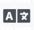

# DIU - Practica 3

## Análisis de MuseMap  

Es una aplicación cuyo objetivo es acercar a los artistas al público ofreciendo información sobre ellos y sus obras.Mientras que nosotros en el desarrollo de nuestra aplicación partimos del análisis de la competencia para resolver  un nuevo desafío que es la economía colaborativa.Ellos han partido desde una pregunta o una preocupación social que son los artistas callejeros.

Otra cosa a observar, es que mientras que nosotros en el desarrollo de nuestra aplicación partimos del análisis de la competencia para resolver  un nuevo desafío que es la economía colaborativa, ellos han partido desde una pregunta o una preocupación social que son los artistas callejeros. Parten de la idea de una persona que ante la inaccesibilidad a información se hace preguntas sin respuesta para sacar ideas.

También han llevado a cabo screener survey (Encuestas de selección) y cuando encuentran un perfil o grupo de interés se le cita para una entrevista. Mientras que nosotros solo hemos preguntado a los familiares o amigos cercanos, ellos han hecho más énfasis en la población en general, que conlleva más variedad de gente con gustos y experiencias y contextos distintos, dando más variedad de información.
Gracias a que ellos parten de la experiencia del usuario el cual les ha permitido añadir más requisitos a la hora de realizar el análisis de competencias, teniendo encuesta mas puntos clave, mientras que nosotros partimos directamente de este, por lo que nuestro análisis no tiene en cuenta en este punto al usuario usuario, si no algo más general y enfocado al punto más del de desarrollador. Con este análisis lo que pretenden es sacar los puntos fuertes de esas aplicaciones, y de lo que carecen, para tenerlos en cuenta a la hora de su desarrollo.Mientras ellos han desarrollado un mapa de empatía nosotros lo hemos enfocado con una malla receptora de información.

Otras cosas a destacar, es la evolución de los bocetos en el tiempo desde sketched wireframe  al mockup final. Y su análisis de de la guia de estilo donde comentan los paleta  de colores, tipografía y iconografía.

## Logotipo

El logotipo final para este proyecto se ha elegido el siguiente:

Para ello buscamos información sobre [consejos](https://www.arturogarcia.com/consejos-para-disenar-un-logotipo/)  y [páginas para su creación](https://www.tailorbrands.com/es/logo-maker).En esta ultima nos dio la idea de añadir un eslogan aunque no se ha llevado a cabo.

Entre los candidatos seleccionados podemos encontrar:

Término  | Icono                          |
| ------------- | -------        |
|  Búho  |  |
|  Abstracto modelo 1 |  |
|  Abstracto modelo 2 |  |
|  Abstracto modelo 3  |  |
|  Cafetería modelo 1  |  |
|  Cafetería modelo 2   |  |

## Propuesta de elementos de diseño o patrones a usar

Decisiones sobre la tipografía:

Para facilitar la lectura vamos a optar por una tipografía como Open Sans.Un ejemplo de ellos serían estos:

Decisiones sobre la paleta de colores:

No hablamos de leer textos o libros, sino de ser lógicos con la identidad de la marca. Por una parte, la gama cromática a escoger debería mostrar cualitativamente su personalidad. Calma, seriedad, profesionalidad, tecnología, entretenimiento son palabras que suelen ser adjudicadas a diferentes marcas y deberían poder representarse mediante una paleta de colores.

Por ejemplo:
Azul: tranquilidad, seguridad, confianza, sanidad, lealtad
Naranja: coraje, simpatía, éxito
Dorado: riqueza, sabiduría, prosperidad, tradicionalismo, valor

Se recomienda no usar un máximo de 3 colores primarios y mantener siempre el equilibrio cromático.
Usar los contrastes para resaltar aquellas cuestiones mas relevantes.
Para poder organizar y determinar la cantidad de color en una app se recomienda usar una proporción de color en pantalla de 60-30-10.

En nuestro caso hemos seleccionado la siguiente paleta de colores, ya que buscamos que la aplicación sea acogedora ya que se va a tratar de una aplicación que requiere contacto social, por lo que queremos transmitir una sensación acogedora.

Esta combinación viva de tonos cálidos y fríos se ve espectacular y contrastante.
El aguamarina, el celeste, el naranja y el amarillo crean una gama de colores naturales.
Crearán un ambiente cálido y acogedor.

Decisiones sobre la iconografía:

Algunos iconos de los bocetos han sido sustituidos por otros para mantener una concordancia con el resto.

Término | Icono | Nuevo
| ------------- | ------- | ------- |
|  Ayuda y soporte  |  |  |
|  Crear grupo o actividad  |  |   |
|  Idioma  |  |   |
|  Perfil   |  |   |

## Historia en Video del UX Case Study

Para poder ver el video de promoción del diseño [pulse aquí](https://www.youtube.com/watch?v=p6QHk09v6gM&feature=youtu.be)

## Valoración del equipo sobre la realización de esta práctica o los problemas surgidos

Hacer estas prácticas nos ha cambiado la visión de cómo comenzar un proyecto en el que antes nos hubiéramos lanzado a escribir código en Android Studio y hacer una aplicación sin tener en cuenta el producto final, y cómo afectaría este al usuario y que en el momento de terminar una beta del proyecto nos hubiéramos dado cuenta de que falta funcionalidad y que no es atractivo o cómodo para el usuario. La parte más difícil consideramos que ha sido ponernos en la piel de otros usuarios y que hemos encontrado otros puntos de vista para poder mejorar o añadir nuevas ideas al proyecto del diseño.Ahora mismo tendríamos más en cuenta al usuario haciendo encuestas sobre una idea y luego haciendo entrevistas entre los posibles grupos de personas que usarían la aplicación.También se ha aprendido muchas técnicas de diseño que verdaderamente son útiles en este momento y que no son técnicas desfasadas, mantener coherencia en diseño, funcionalidades principales destacadas sobre las demás, colocación en función de utilización.
