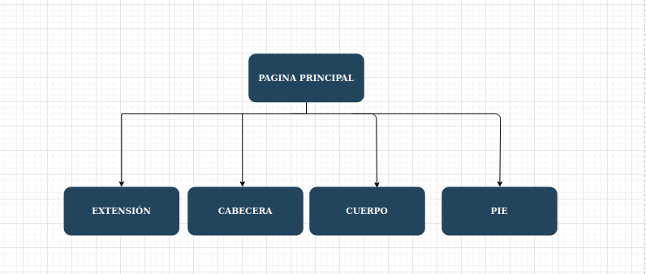

# DIU20
Prácticas Diseño Interfaces de Usuario 2019-20 (Economía Colaborativa)

Grupo: DIU3.Learning.  Curso: 2019/20

Proyecto:

Descripción:

Logotipo:

Miembros
 * :bust_in_silhouette:   https://github.com/salva12345678/DIU     :octocat:     
 * :bust_in_silhouette:   https://github.com/IgnacioMorillas/DIU_2019-2020     :octocat:   
-----

En esta práctica estudiaremos un caso de plataforma de economía colaborativa y realizaremos una propuesta para su diseño Web/movil. Utilizaremos herramientas y entregables descritos en el siguiente CheckList (https://github.com/mgea/UX-DIU-Checklist)

Qué es economia colaborativa: Martínez-Polo, J. (2019). **El fenómeno del consumo colaborativo: del intercambio de bienes y servicios a la economía de las plataformas**, *Sphera Publica, 1*(19), 24-46. http://sphera.ucam.edu/index.php/sphera-01/article/view/363/14141434

>>> Este documento es el esqueleto del report final de la práctica. Aparte de subir cada entrega a PRADO, se debe actualizar y dar formato de informe final a este documento online.En general la web cumple su función, tiene fallos que hace que la persona se canse rápido, y la estética de la interfaz tampoco es la mas adecuada. Es facil de usar, intuitivo y cómodo, el echo de encontrar eventos y crearlos es bastante facil.

# Proceso de Diseño

## Paso 1. UX Desk Research & Analisis

 1.a Competitive Analysis
-----

>>> El caso de economía colaborativa dentro de la experiencia de ocio que vamos a estudiar hace referencia a los idiomas.He encontrado una serie de plataformas que se ajustan a lo que se está buscando.

>>> Entre las aplicaciones y páginas web que hemos visto las que más se adaptan mejor a una experiencia de ocio son [Meetup-Language](https://www.meetup.com/es-ES/find/language/) y [Hi uTandem](https://www.facebook.com/Hiutandemapp/).Entre estas dos se ha elegido [Meetup-Language](https://www.meetup.com/es-ES/find/language/) dado que está disponible en Android y no muestra problemas "graves".

Para más información sobre las otras plataformas  en el Análisis de la Competencia [pulse aquí](https://github.com/IgnacioMorillas/DIU_2019-2020/tree/master/P11)

 1.b Persona
-----

>>>En primer lugar hemos creado a [Manuel](https://github.com/IgnacioMorillas/DIU_2019-2020/tree/master/P1),Una persona con amplias capacidades pero con poca iniciativa en el mundo de las redes sociales y en este sentido Manuel se plantea como un colectivo de la plataforma pues uno de sus retos ya sea por trabajo u ocio le hacen usar esta aplicación.

>>>Por último, también hemos creado a [Noelia](https://github.com/IgnacioMorillas/DIU_2019-2020/tree/master/P1), Es cual es una persona bastante tímida, y que además no está iniciada en el mundo de estas nuevas plataformas por lo tanto le es difícil hacer esta tarea además de que sus circunstancias familiares no la da mucho margen de tiempo libre.

 1.c User Journey Map
----

>>> [El problema de Manuel con el ingles](https://github.com/IgnacioMorillas/DIU_2019-2020/tree/master/P1).

>>> [Encuentro por sorpresa con su ex](https://github.com/IgnacioMorillas/DIU_2019-2020/tree/master/P1).

 1.d Usability Review
----

>>> - Enlace al documento:
      Para ver el PDF [pulse aquí](https://github.com/IgnacioMorillas/DIU_2019-2020/blob/master/P1/Usability-review.pdf)

>>> - Valoración final:64
>>> - Comentario sobre la valoración:En general la web cumple con las principales características y metas que se persiguen.La información que se muestra es precisa y no es redundante.Los resultados de las búsquedas son relevante y precisas.El rendimiento de la página es excelente.Existen otros aspectos que no han sido muy gratificantes.Las funciones de volver atrás fallaban y te llevaba a una pantalla en blanco.En la página hay marcadores que están descuadrados.La ubicación actual no está clara .La búsqueda por parámetros múltiples es bastante pobre.No hay búsquedas comunes sino que ya están definidas.Los usuarios no pueden enviar comentario,no hay correo de la empresa y solo hay un chat de ayuda.

Para más información [pulse aquí](https://github.com/IgnacioMorillas/DIU_2019-2020/blob/master/P1)

## Paso 2. UX Design  

 2.a Feedback Capture Grid
----

En la malla receptora de información que hemos recopilado teniendo en cuenta las buenas características de la web que analizamos en la practica 1,las dificultades que encontraron nuestros usuarios que gracias a ese punto de vista vimos que podían mejorarse y algunas sugerencias para implementar nuevas funcionalidades,llevar a cabo una crítica constructiva centrándonos en los errores críticos que hemos analizado e ideas aportadas por los desarrolladores donde se corregirían funcionalidades y aportar propuestas de valor como es el sistema de bonificación por la asistencia de los eventos en el ámbito de los idiomas ademas de buscar una simbiosis entre los tres protagonistas principales como el usuario,el profesional y el establecimiento para que se beneficien y cooperen.    

Para ver la malla receptora de información [pulse aquí](https://github.com/IgnacioMorillas/DIU_2019-2020/tree/master/P2)

 2.b Tasks & Sitemap
-----

Entre las dos posibilidades nos hemos decidido por por hacer la matriz de tareas para analizar los usuarios que van a usar la aplicación y las tareas principales para poder analizar la frecuencia de uso de las acciones y así poder situar las funcionalidades en la aplicación. Para todo esto se hará un ranking de estas funcionalidades pero también viendo otros aspectos ya que habrá algunas funcionalidades que solo usará uno de los tantos tipos de usuarios que hay.

Para ver la matriz de usuario y tareas [pulse aquí](https://github.com/IgnacioMorillas/DIU_2019-2020/tree/master/P2)

 2.c Labelling
----

Para una mayor comodidad se ha creado una jerarquía principal para tener una vista principal y  luego poder analizar cada sector por separado.

Para ver los diagramas y su correspondiente explicación [pulse aquí](https://github.com/IgnacioMorillas/DIU_2019-2020/tree/master/P2)

 2.d Wireframes
-----

Para esta parte hemos desarrollado una serie de bocetos sobre las distintas partes de la interfaz.Para tener una mayor organización y podamos entender el flujo que sigue se hará un diagrama de flujo de los bocetos.

Para ver los bocetos de la interfaz [pulse aquí](https://github.com/IgnacioMorillas/DIU_2019-2020/tree/master/P2)

## Paso 3. Make (Prototyping)

 3.a Moodboard
-----

>>> Plantear Diseño visual con una guía de estilos visual (moodboard)

  3.b Landing Page
----

>>> Plantear Landing Page

 3.c Guidelines
----

>>> Estudio de Guidelines y Patrones IU a usar

  3.d Mockup
----

>>> Layout: Mockup / prototipo HTML  (que permita simular tareas con estilo de IU seleccionado)

## Paso 4. UX Check (Usability Testing)

 4.a A/B Testing
----

>>> Comprobacion de asignaciones para A/B Testing. Asignaciones https://github.com/mgea/DIU19/blob/master/ABtesting.md

>>>> Práctica A:

 4.b User Testing
----

>>> Usuarios para evaluar prácticas

| Usuarios | Sexo/Edad     | Ocupación   |  Exp.TIC    | Personalidad | Plataforma | TestA/B
| ------------- | -------- | ----------- | ----------- | -----------  | ---------- | ----
| User1's name  | H / 18   | Estudiante  | Media       | Introvertido | Web.       | A
| User2's name  | H / 18   | Estudiante  | Media       | Timido       | Web        | A
| User3's name  | M / 35   | Abogado     | Baja        | Emocional    | móvil      | B
| User4's name  | H / 18   | Estudiante  | Media       | Racional     | Web        | B

. 4.c Cuestionario SUS
----

>>> Usaremos el **Cuestionario SUS** para valorar la satisfacción de cada usuario con el diseño (A/B) realizado. Para ello usamos la [hoja de cálculo](https://github.com/mgea/DIU19/blob/master/Cuestionario%20SUS%20DIU.xlsx) para calcular resultados sigiendo las pautas para usar la escala SUS e interpretar los resultados
http://usabilitygeek.com/how-to-use-the-system-usability-scale-sus-to-evaluate-the-usability-of-your-website/)
Para más información, consultar aquí sobre la [metodología SUS](https://cui.unige.ch/isi/icle-wiki/_media/ipm:test-suschapt.pdf)

>>> Adjuntar captura de imagen con los resultados + Valoración personal

 4.c Usability Report
----

>> Añadir report de usabilidad para práctica B

## Paso 5. Evaluación de Accesibilidad  

  5.a Accesibility evaluation Report
----

>>> Indica qué pretendes evaluar (de accesibilidad) y qué resultados has obtenido + Valoración personal

>>> Evaluación de la Accesibilidad (con simuladores o verificación de WACG)

## Conclusión / Valoración de las prácticas

>>> (90-150 caracteres) Opinión del proceso de desarrollo de diseño siguiendo metodología UX y valoración (positiva /negativa) de los resultados obtenidos  
